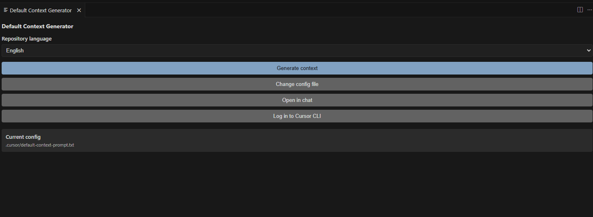

# Project context — Default Context Generator

## Overview

This repository is the **Default Context Generator**: automation to generate **context**, **rules**, and **skills** for Cursor in any Git repository. The Cursor (agent) runs the flow; there is no heavy CLI — the logic lives in skills and rules (Markdown).

**What the project does:**

- Provides an **orchestration skill** (`default-context-generator`) that defines the workflow: **interpret existing documentation** (when present) and index it by area of expertise → analyze repo → documentation by area (reusing existing doc) → rules with skill allocation.
- The generator **adapts to the type of repository**: with or without documentation, in varied formats (README, docs/, ADR, API docs, etc.); it interprets whatever exists and indexes by area to reuse as much as possible.
- Provides **domain skills** (arquiteto-software, backend, frontend, ux-ui, devops, seguranca, marketing, testing, data-database, docs-tecnico, acessibilidade, performance, system-design) to map and document projects.
- Includes a **Cursor/VS Code extension** that exposes the "Generate project context" command (copies the prompt and tries to open chat). The extension is **internationalized**: English (primary) and Portuguese (secondary); see `.cursor/rules/i18n.mdc`.
- It is designed for use in **any repo**: the user runs the flow (chat or extension) on the target repo and gets `docs/context/` and `.cursor/rules/` generated.

## Stack

| Layer   | Technology                    | Where |
|---------|-------------------------------|-------|
| Extension | VS Code Extension API, TypeScript | `src/extension.ts` |
| Content | Markdown (skills, rules, docs) | `.cursor/`, `docs/` |
| Build   | TypeScript 5, npm             | `package.json`, `tsconfig.json` |

- **Runtime:** Node (via VS Code/Cursor).
- **Main language:** TypeScript (extension only).
- **Documentation:** README.md (usage and extension); PROJECT_IDEA.md (vision and requirements, when present).

## Project areas

| Area | Description | Document |
|------|-------------|----------|
| Extension | VS Code/Cursor command, clipboard, opening chat | [extension.md](extension.md) |
| Skills and rules | Generator content (orchestration + domain), format, usage | [skills-e-rules.md](skills-e-rules.md) |
| Technical documentation | README, PROJECT_IDEA (if present), project doc conventions | [docs-tecnico.md](docs-tecnico.md) |
| Existing doc in repos | Interpreting and indexing existing documentation by area | [doc-existing-repos.md](doc-existing-repos.md) |
| i18n | Primary language EN, secondary PT; rule and extension strings | `.cursor/rules/i18n.mdc`, `package.nls*.json`, `src/nls.ts` |

## Folder structure (relevant)

```
defaultcontextgenerator/
├── package.json          # Extension manifest
├── tsconfig.json
├── src/
│   └── extension.ts      # "Generate project context" command
├── .cursor/
│   ├── rules/            # gerar-contexto.mdc (+ area rules if any)
│   └── skills/           # default-context-generator + 13 domain skills
├── docs/
│   └── context/          # This context (README + docs by area)
├── README.md             # Usage, extension, how to test
└── PROJECT_IDEA.md      # Vision, flow, future extension (when present)
```

## Technology references

- [VS Code Extension API](https://code.visualstudio.com/api) — commands, clipboard, `executeCommand`.
- [Cursor](https://cursor.com/docs) — chat/composer, agent; extensions are compatible with VS Code.
- Skills and rules: see `.cursor/skills/default-context-generator/SKILL.md` and Cursor's create-rule / create-skill (when available).
